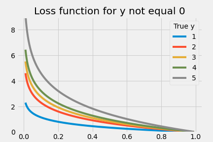

# Fact checking

This project aims to detect false claims based on a dataset of sentences from various sources. Our goal is to build a classifier, that will pick up some signal from this data and achieve the best possible ROC AUC score.

## Data

 Data is taken from https://home.ipipan.waw.pl/sj/Warsztaty/.

It consist of 7 text columns:

* *statement*
* *subject* of a statement
* *speaker* name
* *job* of a speaker
* US *state*
* *party* of a speaker
* *context*

For every row we also have a *label*, which is the degree of truth of a statement (pants-fire, false, barely-true, half-true, mostly-true, true). We will be only interested in classifying pants-fire vs not statements, but as we will see other labels are turn out to be useful as well.

## Structure of a project

1. `baseline.ipynb`- notebook with a baseline model
2. `utils.py`useful functions (transformers and evaluation)
3. `models.py` weighted logistic regression and neural network implemented in torch
4. `custom_loss_evaluation.ipynb` evaluation of a custom loss function
5. `model_comparision.ipynb` comparing custom loss vs standard model with cross-validation and statistical tests
6. `fact-checking-final.ipynb` notebook with bert embeddings and final evaluation

## Baseline model

As a baseline model I used standard logistic regression after preprocessing data with TF-IDF vectorizers. All of that is put together using scikit-learn's pipeline of column transformer and logistic regression classifier.

## Custom loss function

Since we have other scores besides false/true, we may leverage that to our advantage. I believe, that there is some uncertainty in labelling this data. For example, it could be arbitrary to decide whether a statement is completely false or just false. Because of that, we will use lower weights for examples that have labels closer to False, but we will penalize classifying surely true statement as false.

Here is how such loss looks like for various classes (higher y means more true):

Since we are using torch, we don't have to constraint ourselves to binary cross entropy loss (logarithm of a probability) and can use arbitrary differentiable loss, for example hinge. I evaluated multiple possible weights for this loss, and it turned out that weights=[1-g, 1, 1+g, 1+2*g, 1+3*g] work best for g=0.6 (each weight for each consecutive class). 

It turns out that such loss function improves mean of cross validation ROC AUC of models in all experiments that I run (including final one). It is crucial for obtaining better performance and detecting more signal from this data.

## Embeddings

Since we are working with sentences, we can expect to extract more meaning from them by using word embeddings pretrained on large corpora of texts. Recently, they turned out to have quite amazing performance. However, it is not clear, that they would outperform simpler text-mining models and that's what I decided to test.

I decided to use embeddings of statement and context since they are mostly a little bit longer sequences of words. Embeddings that worked the best were taken from **RoBERTa** base model. It turned out to be useful to still use TF-IDF features of statement since they provided additional improvements of a model. 

 It would be also possible to get rid of any text mining and feature engineering by fine-tuning bert, feeding to it all of our data, where each row could be separated for example by \<SEP\> token. That approach worked for some people that did the task, and is a promising and probably a little bit cleaner way of solving this problem.

## Final evaluation

My model achieved an average of 0.7859 ROC AUC score on 10 fold cross-validation. This estimate is biased, since I am not using the whole training data. On a hidden test set, which I didn't have an access to, my model achieved **0.7944 ROC AUC** which turned out to be the best out of 24 submissions. The best scores that didn't use word embeddings was 0.7869 (which is actually not that different), there was also a submission that got 0.7876 and used BERT, but with standard objective.

My two observations here is that embeddings are useful (but maybe not that useful as we would like them to be), and sometimes it is possible to get more from data, by using more available information and some modelling tricks.

